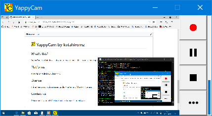

#  YappyCam by katahiromz

## What's this?

YappyCam is a Windows software to create movie files from screen capture or Web camera.

It can also record sound from speaker or microphone.

Download: https://katahiromz.web.fc2.com/yappycam/en

## Platforms

It works on Windows Vista/7/10.

## License

It is a freeware that is released under the terms of the MIT license.

## Contact us

Katayama Hirofumi MZ
katayama.hirofumi.mz@gmail.com
